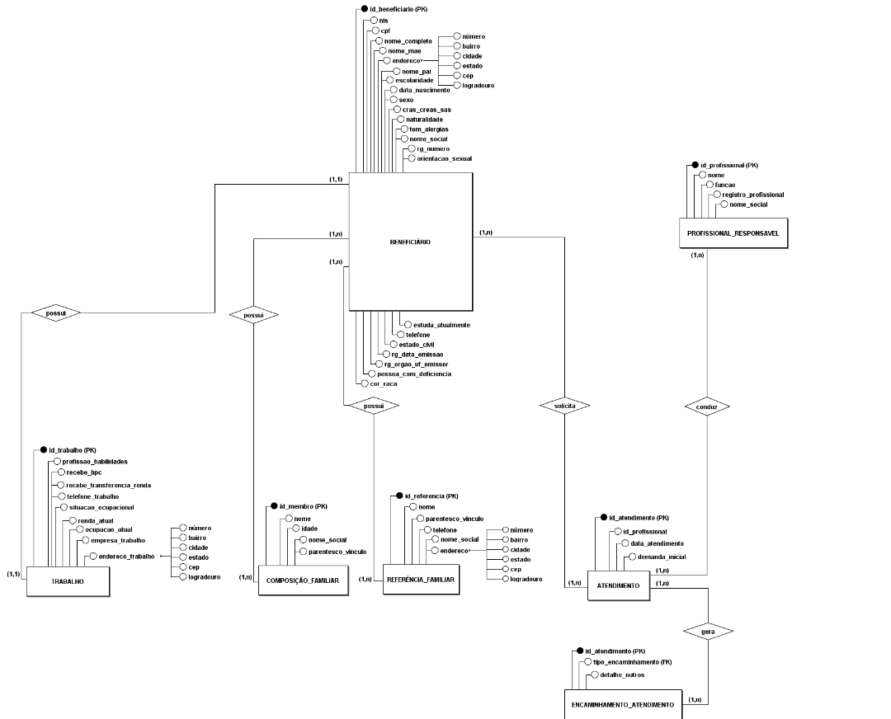

# Projeto de Modelagem Conceitual (DER) - Organização Social Nossa Senhora de Fátima

**Integrantes / Autores:**
* Gabriel Simões da Silva (RGM 47327383)
* Henrique Novais de Oliveira (RGM 47046996)
* Leandro Miranda da Silva (RGM 47397349)
* Mateus Alves dos Santos (RGM 47435887)
* Washington de Souza Silva (RGM 49080156)

---

# 0. Processo

## Triagem dos dados e DER

# 1. Diagnóstico do status e a organização

### Visão 1: O Acesso e levantamento do grupo

* **Nome e/ou sigla da organização:** Organização Social Nossa Senhora de Fátima (CNPJ: 32.667.614/0001-18).
  * **E-mail:** [ongnossasenhoradefatima@gmail.com](mailto:ongnossasenhoradefatima@gmail.com)
  * **Site:** [www.ongnossasenhoradefatima.com.br](http://www.ongnossasenhoradefatima.com.br)
  * **Assistente Social Responsável:** Maria Aparecida Fernandes Ferreira de Souza
  * **Telefone:** (11) 96972-4382
* **Acesso à ONG:** Contato direto por meio de voluntariado ativo no setor de um dos integrantes do grupo e entrevista presencial com a equipe técnica.
* **Descreva o porte:** Organização de pequeno porte, atendendo fixamente cerca de 250 famílias cadastradas na região. Conta com o Presidente e 5 voluntários recorrentes de forma fixa.
* **Serviços e como dados eram gerados:** Triagem e atendimento social presencial, encaminhamentos para moradia, saúde mental (AMA, CAPS, UBS), assistência jurídica e moradia universitária, além de distribuição de cestas básicas. Os dados eram gerados exclusivamente em formato manual através de fichas de atendimento impressas.
* **Problema a ser resolvido:** Centralização e digitalização das informações dos beneficiários. O controle atual é 100% físico e impresso, o que gera gargalos na troca de informações, risco de desgaste do papel e dificuldade na busca de históricos de atendimentos. O novo sistema eliminará a dependência do papel, garantindo agilidade e conformidade com a LGPD.

---

## 1. Descrição do Negócio
> Visão 1.1: Descrição e Funcionamento
* A Organização Social Nossa Senhora de Fátima é uma entidade sem fins lucrativos focada no acolhimento de pessoas em situação de vulnerabilidade social na região da Mooca. O fluxo operacional inicia-se no atendimento "de porta aberta", onde a assistente social realiza uma entrevista individualizada e preenche a ficha de triagem (dados pessoais, profissionais, composição familiar e demandas). A partir dessa avaliação, a ONG presta auxílio direto (montagem e entrega de cestas básicas não padronizadas) ou realiza encaminhamentos externos para redes de apoio (saúde mental, assistência jurídica, habitação e empregabilidade). Atualmente, a doação de alimentos é intermediada por parceiros como Banco de Alimentos e Cidade Invisível, e o controle de passeios sociais/culturais é organizado nos finais de semana. O novo sistema automatizará o registro cadastral, o histórico de demandas e os encaminhamentos efetuados.

---

## 2. Requisitos do Sistema
> Visão 2: O que o sistema precisa fazer e ter para resolver as necessidades da ONG.

### 2.1 Requisitos Funcionais
* [RF01] Registrar beneficiários com dados pessoais, de contato e localização.
* [RF02] Registrar composição familiar, situação de trabalho/renda e referências do beneficiário.
* [RF03] Registrar a triagem inicial com as demandas sociais apresentadas.
* [RF04] Registrar os encaminhamentos realizados para órgãos parceiros e serviços estatais.
* [RF05] Registrar o Plano Individual de Atendimento (PIA) para acompanhamento contínuo dos beneficiários.
* [RF06] Permite consultar, atualizar e arquivar histórico de atendimentos e fichas cadastradas.

## 2.2 Requisitos Não Funcionais

* **[RNF01] Segurança e Privacidade (LGPD):** Acesso restrito e hierarquizado (dados sensíveis de triagem visíveis apenas pela assistente social e psicóloga).
* **[RNF02] Usabilidade:** Interface simples, intuitiva e acessível para facilitar o uso pela equipe técnica e voluntários.
* **[RNF03] Desempenho:** As operações de consulta e salvar cadastros devem retornar em **até 2 segundos**, garantindo uma navegação fluida para o usuário.
* **[RNF04] Disponibilidade:** Sistema disponível em tempo integral, com suporte a acessos simultâneos e atualizações em tempo real.
* **[RNF05] Backup:** Rotinas automatizadas de backup e recuperação de dados.
* **[RNF06] Escalabilidade e Integração:** Arquitetura modular preparada para o crescimento da base de usuários e para futuras integrações com sistemas externos.

---

## 3. Regras de Negócio
> Visão 3.1: Quais são as regras do negócio?
* **RN01 (Cadastro Único):** Cada beneficiário é identificado unicamente por CPF ou NIS, evitando duplicidade de atendimento.
* **RN02 (Sigilo de Informações):** Apenas profissionais credenciados (Assistente Social / Psicóloga) possuem permissão para visualizar e alterar detalhes da triagem e diagnósticos sociais.
* **RN03 (Obrigatoriedade na Triagem):** Toda solicitação de assistência ou encaminhamento exige o preenchimento prévio dos dados fundamentais de triagem social.
* **RN04 (Continuidade via PIA):** Atendimentos contínuos e acompanhamentos em abrigos exigem a vinculação de um Plano Individual de Atendimento (PIA).

> "Por que essa regra?"
* A **RN01** impede fraudes e garante distribuição justa de recursos. A **RN02** assegura o cumprimento estrito da LGPD e protege a privacidade dos atendidos. As regras **RN03** e **RN04** padronizam o atendimento técnico, garantindo que o histórico do beneficiário seja preservado para prestação de contas e encaminhamentos efetivos.
---

## 4. Dicionário de Dados Conceitual (Preliminar)
> Visão 4.1: Organização dos dados e regras associadas ao Dicionário.

### 4.1 Entidade: Beneficiário
*(Reflete a Seção "Dados do Beneficiário", "Filiação", "Educação" e "Trabalho" - Pág. 1 da ficha)*

| Atributo | Descrição | Regra de negócio associada | Tipo | Domínio / Formato | Obrig. |
| :--- | :--- | :--- | :--- | :--- | :---: |
| `id_beneficiario` | Identificador único do beneficiário no sistema | Gerado automaticamente no cadastro; nunca reutilizado | Numérico (PK) | Sequencial | Sim |
| `nis` | Número de Identificação Social no CadÚnico | Cruzamento com CRAS/CREAS/SAS e programas de renda | Categórico | Texto | Não |
| `cras_creas_sas` | Unidade socioassistencial vinculada | Indica o equipamento público que acompanha o caso | Categórico | Texto | Não |
| `nome_completo` | Nome civil do beneficiário | Campo básico e obrigatório de identificação | Categórico | Texto | Sim |
| `nome_social` | Nome de preferência do beneficiário | Priorizado no atendimento presencial | Categórico | Texto | Não |
| `sexo` | Sexo do beneficiário | Campo de marcação única | Categórico | (F, M) | Sim |
| `orientacao_sexual` | Orientação sexual autodeclarada | Dado sensível (LGPD); acesso restrito | Categórico | (Hetero, Homo, Bi, LGBTQIA+, Outros) | Não |
| `data_nascimento` | Data de nascimento do beneficiário | Base para cálculo de idade e benefícios (ex. BPC) | Data | DD/MM/AAAA | Sim |
| `naturalidade` | Município e estado de nascimento | Perfil socioeconômico sem uso restritivo | Categórico | Texto | Não |
| `cor_raca` | Cor/raça autodeclarada | Dado sensível (LGPD); fins estatísticos de equidade | Categórico | (Branco, Negro, Indígena, Pardo) | Não |
| `pessoa_com_deficiencia` | Indica se possui deficiência e o CID | Dado sensível (LGPD); priorização de encaminhamentos | Categórico | (Não; Sim - CID) | Não |
| `tem_alergias` | Indica se possui alergias relevantes | Relevante para doações de alimentos e eventos | Categórico | (Não; Sim - Qual) | Não |
| `cpf` | Número do CPF | Identificador único complementar; evita duplicidade | Categórico | 000.000.000-00 | Não |
| `rg_numero` | Número do RG | Documento de identificação civil | Categórico | Texto | Não |
| `rg_orgao_uf_emissor` | Órgão emissor e UF do RG | Detalha a origem do documento | Categórico | Texto (ex: SSP/SP) | Não |
| `rg_data_emissao` | Data de emissão do RG | Verifica atualização do documento | Data | DD/MM/AAAA | Não |
| `rg_ano_emissao` | Ano de emissão do RG | Campo específico presente na ficha física | Numérico | AAAA | Não |
| `estado_civil` | Estado civil do beneficiário | Lista fechada de opções cadastrais | Categórico | (Solteiro, Casado, Divorciado, Viúvo, etc.) | Não |
| `endereco` | Endereço residencial do beneficiário | Necessário para visitas e distribuição de doações | Categórico | Texto | Sim |
| `bairro` | Bairro de residência | Mapeamento territorial de atuação (ex.: Mooca) | Categórico | Texto | Não |
| `cidade_estado` | Cidade e estado de residência | Complemento de localização | Categórico | Texto | Não |
| `cep` | CEP do endereço residencial | Triagem e localização territorial | Categórico | 00000-000 | Não |
| `telefone` | Telefone principal de contato | Agendamento e aviso de atendimentos/eventos | Categórico | (00) 00000-0000 | Não |
| `nome_mae` | Nome da mãe do beneficiário | Filiação complementar para identificação | Categórico | Texto | Não |
| `nome_pai` | Nome do pai do beneficiário | Filiação complementar | Categórico | Texto | Não |
| `escolaridade` | Nível de escolaridade concluído | Orienta encaminhamentos para EJA/cursos técnicos | Categórico | (Analfabeto, Fundamental, Médio, Superior) | Não |
| `estuda_atualmente` | Indica se estuda no momento e onde | Planejamento de encaminhamentos educacionais | Categórico | (Não; Sim - Onde) | Não |
| `profissao_habilidades` | Profissão ou habilidades autodeclaradas | Encaminhamento a vagas de trabalho e capacitação | Categórico | Texto livre | Não |
| `situacao_ocupacional` | Situação de trabalho atual | Avaliação de vulnerabilidade socioeconômica | Categórico | (Empregado, Desempregado, BPC, Autônomo) | Não |
| `renda_atual` | Renda mensal individual | Dado financeiro restrito; dimensiona o apoio | Numérico | Decimal (R$) | Não |
| `empresa_trabalho` | Nome da empresa onde trabalha | Preenchido apenas para trabalhadores formais/informais | Categórico | Texto | Não |
| `endereco_trabalho` | Endereço do local de trabalho | Complementa perfil ocupacional | Categórico | Texto | Não |
| `cep_trabalho` | CEP do local de trabalho | Detalhe territorial do trabalho | Categórico | 00000-000 | Não |
| `bairro_trabalho` | Bairro do local de trabalho | Detalhe territorial do trabalho | Categórico | Texto | Não |
| `distrito_trabalho` | Distrito do local de trabalho | Detalhe territorial do trabalho | Categórico | Texto | Não |
| `telefone_trabalho` | Telefone do local de trabalho | Contato profissional alternativo | Categórico | (00) 00000-0000 | Não |
| `ocupacao_atual` | Ocupação exercida no momento | Identificação de subemprego ou função real | Categórico | Texto | Não |
| `recebe_transferencia_renda` | Indica se recebe benefício social | Evita duplicidade de concessões financeiras | Categórico | (Não; Sim - Qual) | Não |
| `recebe_bpc` | Indica se recebe BPC | Priorização socioassistencial | Categórico | (Não; Sim - Idoso; Sim - PcD) | Não |

---

### 4.2 Entidade: Membro_Familia
*(Reflete a Tabela "Composição Familiar - Quem mora com você", Pág. 2 da ficha)*

| Atributo | Descrição | Regra de negócio associada | Tipo | Domínio / Formato | Obrig. |
| :--- | :--- | :--- | :--- | :--- | :---: |
| `id_membro` | Identificador único do integrante | Gerado a cada dependente cadastrado | Numérico (PK) | Sequencial | Sim |
| `id_beneficiario` | Beneficiário titular do cadastro | Um integrante pertence a 1 beneficiário | Numérico (FK) | Existir em Beneficiário | Sim |
| `nome` | Nome do familiar | Limite máximo de até 5 integrantes por ficha | Categórico | Texto | Sim |
| `idade` | Idade do familiar no cadastro | Dimensiona cestas e encaminhamentos familiares | Numérico | Inteiro | Sim |
| `parentesco_vinculo` | Relação de parentesco com o titular | Identifica dependência (filho, cônjuge, mãe, etc.) | Categórico | Texto | Sim |

---

### 4.3 Entidade: Referencia_Familiar
*(Reflete o Bloco "Referência Familiar", Pág. 2 da ficha)*

| Atributo | Descrição | Regra de negócio associada | Tipo | Domínio / Formato | Obrig. |
| :--- | :--- | :--- | :--- | :--- | :---: |
| `id_referencia` | Identificador único da referência | Gerado a cada contato adicionado | Numérico (PK) | Sequencial | Sim |
| `id_beneficiario` | Beneficiário titular do cadastro | Uma referência pertence a 1 beneficiário | Numérico (FK) | Existir em Beneficiário | Sim |
| `nome` | Nome do contato de referência | Limite de até 3 referências de emergência | Categórico | Texto | Sim |
| `parentesco_vinculo` | Grau de relação/vínculo | Ex.: vizinho, amigo, parente distante | Categórico | Texto | Não |
| `telefone` | Telefone de contato da referência | Usado quando o beneficiário está inacessível | Categórico | (00) 00000-0000 | Não |
| `endereco` | Endereço da referência | Localização alternativa em caso de urgência | Categórico | Texto | Não |

---

### 4.4 Entidade: Atendimento
*(Reflete o Bloco "Demanda Inicial Apresentada" + Assinatura do Técnico, Pág. 2 da ficha)*

| Atributo | Descrição | Regra de negócio associada | Tipo | Domínio / Formato | Obrig. |
| :--- | :--- | :--- | :--- | :--- | :---: |
| `id_atendimento` | Identificador único do atendimento | Permite histórico de múltiplos atendimentos por pessoa | Numérico (PK) | Sequencial | Sim |
| `id_beneficiario` | Beneficiário atendido | Todo atendimento pertence a 1 beneficiário | Numérico (FK) | Existir em Beneficiário | Sim |
| `id_profissional` | Técnico responsável pela sessão | Exige identificação do profissional habilitado | Numérico (FK) | Existir em Profissional | Sim |
| `data_atendimento` | Data de realização do atendimento | Data da sessão técnica (São Paulo, DD/MM/AAAA) | Data | DD/MM/AAAA | Sim |
| `demanda_inicial` | Necessidade declarada na triagem | Origina os encaminhamentos sociais subsequentes | Categórico | Texto livre | Sim |

---

### 4.5 Entidade: Encaminhamento_Atendimento
*(Tabela Relacional - Reflete o Bloco "Encaminhamentos Realizados", Pág. 2 da ficha)*

| Atributo | Descrição | Regra de negócio associada | Tipo | Domínio / Formato | Obrig. |
| :--- | :--- | :--- | :--- | :--- | :---: |
| `id_atendimento` | Atendimento que gerou a ação | Mapeia múltiplos encaminhamentos por atendimento | Numérico (FK/PK) | Existir em Atendimento | Sim |
| `tipo_encaminhamento` | Categoria do encaminhamento | Domínio fechado de 30 opções padronizadas | Categórico (PK) | Lista de 30 Opções | Sim |
| `detalhe_outros` | Especificação para "Outros" | Preenchido apenas se o tipo for "Outros. Qual?" | Categórico | Texto | Não |

* **Domínio de `tipo_encaminhamento` (30 opções padronizadas):** Atualização cadastral CAD Único/PTR; Inclusão em programa de transferência de renda; Inclusão no BPC; Orientação de débito de contas de consumo; Regularização de documentação civil; Transporte Urbano (Bilhete Único Especial); Passagem Intermunicipal/Interestadual; Alimentação (Bom Prato/Cesta Básica); Solicitação de Carteira do Idoso; INSS (orientação/aposentadoria/auxílio); Inserção Rede Socioassistencial Básica; Inserção Rede Socioassistencial Especial; Inserção Rede Socioassistencial Local; Inserção Rede Setorial SAS Mooca; Orientação ao Imigrante; Habitação Social (MCMV/CDHU/COHAB); Capacitação Profissional; Inserção no mercado de trabalho; Educação (EJA/Técnico/Faculdade); Tratamento de Saúde; Curso de Informática; Curso de Idiomas; Curso de Educação Financeira; Defesa e proteção ao Idoso; Defesa e proteção à PcD; Defesa e proteção à mulher; Defesa e proteção à criança e adolescente; Defesa dos direitos LGBTQIA+; Defesa e proteção animal; Outros. Qual?

---

### 4.6 Entidade: Profissional_Responsavel
*(Reflete a Assinatura do Técnico, Rodapé da Pág. 2 da ficha)*

| Atributo | Descrição | Regra de negócio associada | Tipo | Domínio / Formato | Obrig. |
| :--- | :--- | :--- | :--- | :--- | :---: |
| `id_profissional` | Identificador único do técnico | Gerado no cadastro da equipe técnica | Numérico (PK) | Sequencial | Sim |
| `nome` | Nome completo do profissional | Identificação do responsável (ex: "Maria Fernandes") | Categórico | Texto | Sim |
| `funcao` | Cargo/função exercida na ONG | Controla níveis de acesso a dados sensíveis | Categórico | Texto (ex.: Assistente Social) | Sim |
| `registro_profissional` | Número no conselho de classe | Validação legal e profissional (ex.: CRESS/CRP) | Categórico | Texto | Sim |

---

## 5. Modelagem Conceitual - Entidades e Relacionamentos
> Visão 5.1: Modelo Conceitual do BD

### Entidades Reconhecidas
* **`BENEFICIÁRIO`**: Centraliza os dados individuais e cadastrais do cidadão atendido.
* **`TRABALHO`**: Armazena o perfil ocupacional, renda e dados do local de trabalho.
* **`COMPOSIÇÃO_FAMILIAR`**: Guarda as informações dos membros que residem no mesmo domicílio.
* **`REFERÊNCIA_FAMILIAR`**: Armazena os contatos externos e de emergência do beneficiário.
* **`DEMANDA_INICIAL`**: Registra as necessidades declaradas durante as triagens.
* **`ENCAMINHAMENTO`**: Registra os direcionamentos e encaminhamentos externos efetuados.

### Relacionamentos e Cardinalidades (baseados no DER)
* **BENEFICIÁRIO (0,n) --- POSSUI --- (0,n) TRABALHO**: Um beneficiário pode ter cadastrado nenhum ou múltiplos registros de trabalho.
* **BENEFICIÁRIO (0,n) --- POSSUI --- (0,n) COMPOSIÇÃO_FAMILIAR**: Um beneficiário pode possuir de zero a múltiplos integrantes familiares cadastrados.
* **BENEFICIÁRIO (0,n) --- POSSUI --- (0,n) REFERÊNCIA_FAMILIAR**: Um beneficiário pode ter cadastrado de zero a múltiplas referências de apoio externo.
* **BENEFICIÁRIO (0,n) --- APRESENTA --- (0,n) DEMANDA_INICIAL**: Um beneficiário pode registrar nenhuma ou múltiplas demandas ao longo do tempo.
* **BENEFICIÁRIO (0,n) --- RECEBE --- (0,n) ENCAMINHAMENTO**: Um beneficiário pode receber de zero a múltiplos encaminhamentos durante seu acompanhamento.

---

## 6. Diagrama Entidade-Relacionamento (DER)
> Visão 6.1: O seu DER para a ONG

*(Certifique-se de que a imagem `1000321831.jpg` esteja subida na raiz do repositório no GitHub)*

---

## 7. Justificativa Técnica
> Visão 7.1: Explicar as escolhas da modelagem do BD para a ONG.

### Escolha das Entidades e Atribuição de Atributos
* **BENEFICIÁRIO:** Entidade central do sistema. Armazena os dados demográficos e de identificação individual do assistido (`cpf`, `nis`, `nome_completo`, `data_nascimento`, `escolaridade`, `possui_deficiencia`, `tipo_deficiencia`, etc.). O endereço foi modelado como atributo composto (`logradouro`, `numero`, `bairro`, `cidade`, `estado`, `cep`) para permitir pesquisas geográficas detalhadas.
* **TRABALHO:** Isolou-se as informações socioeconômicas (`renda_mensal`, `situacao_profissional`, `empresa`, `ocupacao_atual`, `endereco_trabalho`, etc.) da tabela principal para suportar histórico profissional sem poluir o cadastro do beneficiário.
* **COMPOSIÇÃO_FAMILIAR:** Guarda `nome`, `idade` e `parentesco_vinculo` dos moradores da mesma residência, identificada unicamente por `id_familiar`.
* **REFERÊNCIA_FAMILIAR:** Guarda `nome`, `parentesco_vinculo`, `telefone` e o endereço composto da pessoa de contato externo para emergências.
* **DEMANDA_INICIAL:** Mapeia as necessidades relatadas na triagem inicial através da chave `id_demanda`, registrando `descricao` e `data_registro`.
* **ENCAMINHAMENTO:** Mapeia as ações institucionais (CRAS, saúde, habitação, etc.) através da chave `id_encaminhamento`, registrando `tipo_encaminhamento`, `descricao` e `data_encaminhamento`.

---

### Relacionamentos e Cardinalidades
* **BENEFICIÁRIO (0,n) --- POSSUI --- (0,n) TRABALHO:** O beneficiário pode não possuir vínculo de trabalho cadastrado (0) ou possuir múltiplos registros/históricos (n).
* **BENEFICIÁRIO (0,n) --- POSSUI --- (0,n) COMPOSIÇÃO_FAMILIAR:** O assistido pode morar sozinho (0) ou registrar múltiplos membros familiares (n).
* **BENEFICIÁRIO (0,n) --- POSSUI --- (0,n) REFERÊNCIA_FAMILIAR:** Permite cadastrar de zero a múltiplas referências de apoio externo.
* **BENEFICIÁRIO (0,n) --- APRESENTA --- (0,n) DEMANDA_INICIAL:** Um beneficiário pode passar por múltiplos atendimentos ao longo do tempo, registrando diferentes demandas.
* **BENEFICIÁRIO (0,n) --- RECEBE --- (0,n) ENCAMINHAMENTO:** Um assistido pode não receber encaminhamentos no primeiro contato ou receber diversos durante seu acompanhamento social.

---

### Decisões de Abstração e Alternativas Rejeitadas
* **Uso de PKs Sintéticas (`id_*`):** Rejeitou-se o uso de `cpf` ou `nis` como Chave Primária (PK) em `BENEFICIÁRIO`, pois indivíduos em extrema vulnerabilidade podem não possuir esses documentos no primeiro atendimento.
* **Normalização de Listas e Tabelas Secundárias (1FN):** Manter os membros da família ou encaminhamentos na própria tabela de beneficiários geraria campos repetitivos (`filho_1`, `filho_2`) ou dados atômicos violados (1ª Forma Normal). A criação de entidades separadas garante escalabilidade e previne redundâncias.
* **Histórico Atemporal:** Transformar demandas e encaminhamentos em entidades independentes com datas permite rastrear a evolução do atendimento do cidadão ao invés de sobrescrever suas informações a cada retorno.

---

## 8. Uso de Inteligência Artificial
> Registro de uso de ferramentas de IA no apoio à estruturação técnico-acadêmica do projeto.

* **Ferramenta de IA utilizada:** Google Gemini.
* **Etapa de uso:** Estruturação da documentação em Markdown, adaptação da entrevista e transcrição do Dicionário de Dados Conceitual para as tabelas do esqueleto oficial do projeto.
* **Motivação:** Agilizar a organização dos requisitos levantados em campo e garantir que o modelo textual do `README.md` seguisse estritamente o padrão solicitado pelo professor.
* **Prompt(s) utilizados:** *"Organize as informações da entrevista e o PDF do dicionário de dados da ONG no esqueleto Markdown exigido pelo professor."*
* **Resposta recebida:** Código Markdown estruturado com tabelas, justificativas técnicas e alinhamento do DER.
* **Fontes e verificações:** O grupo revisou todas as tabelas e justificativas em relação à ficha física e às respostas obtidas na entrevista com a assistente social.
* **Rejeições/Correções:** Ajustes nos nomes dos atributos para manter o padrão `snake_case` e preservação integral dos 30 itens de domínio de encaminhamento.
* **Reflexão crítica:** A IA foi essencial para acelerar a formatação visual e estrutural, mas o conhecimento técnico do grupo e o contato real com a ONG foram determinantes para validar a consistência das regras de negócio e a utilidade do sistema.

---

## 9. Conclusão e Avaliação dos Integrantes

### Considerações Finais
O desenvolvimento da modelagem conceitual para a Organização Social Nossa Senhora de Fátima permitiu ao grupo vivenciar na prática a transição de um processo puramente manual (baseado em papel) para uma arquitetura de dados digital moderna e estruturada. O sistema proposto solucionará os principais problemas apontados pela equipe técnica: a perda de agilidade nos atendimentos, a dificuldade no acompanhamento histórico dos beneficiários e a necessidade de adequação às diretrizes da LGPD no tratamento de dados sensíveis.

---

## 10. Referências
* ORGANIZAÇÃO SOCIAL NOSSA SENHORA DE FÁTIMA. **Ficha de Cadastro e Triagem Socioassistencial**. São Paulo, 2026. Entrevista e pesquisa de campo concedidas à equipe acadêmica.

